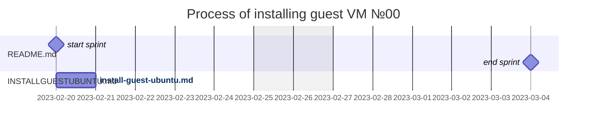

# Runtime setup


> ⚠️ | [markdown github](https://guides.github.com/features/mastering-markdown)
> - | -

> ⚠️ | [markdown stackedit](https://stackedit.io)
> - | -

# Base machine


## static local ip
- login to http://192.168.0.1 / network / lan
- copy MAC address
- locate to Network / LAN / DHCP binding / IP-address: 192.168.0.22
- paste MAC-address
## ssh
- remote shell
```sh
cp /etc/ssh/sshd_config /etc/ssh/sshd_config.ORIGINAL
logout
```
- local shell
```sh
ssh-copy-id i@192.168.0.22
```
- remote shell
```sh
sed -i 's:#PasswordAuthentication yes:PasswordAuthentication no\nChallengeResponseAuthentication no:' /etc/ssh/sshd_config
sed -i 's:#PubkeyAuthentication yes:PubkeyAuthentication yes:' /etc/ssh/sshd_config
service ssh reload
logout
```
## docker
```sh
# docker https://docs.docker.com/engine/install/ubuntu/#install-using-the-repository
#
sudo apt-get remove docker docker-engine docker.io containerd runc
#
sudo apt-get update
sudo apt-get install \
    ca-certificates \
    curl \
    gnupg \
    lsb-release
#
sudo mkdir -m 0755 -p /etc/apt/keyrings
curl -fsSL https://download.docker.com/linux/ubuntu/gpg | sudo gpg --dearmor -o /etc/apt/keyrings/docker.gpg
#
echo \
  "deb [arch=$(dpkg --print-architecture) signed-by=/etc/apt/keyrings/docker.gpg] https://download.docker.com/linux/ubuntu \
  $(lsb_release -cs) stable" | sudo tee /etc/apt/sources.list.d/docker.list > /dev/null
#
sudo apt-get update
#
#
#
sudo apt-get install docker-ce docker-ce-cli containerd.io docker-buildx-plugin docker-compose-plugin
# * You can change the configuration of this build by modifying the files $
# * Additional certificates used by the Docker daemon to authenticate with$
# **Running Docker as normal user** 
#
# By default, Docker is only accessible with root privileges (`sudo`). If $
sudo addgroup --system docker
sudo adduser $USER docker
sudo newgrp docker
sudo snap disable docker
sudo snap enable docker
```
> 
> __docker reccomends:__
>```sh
># collectd: losst.ru/nastrojka-collectd-dlya-nachinayushhih
># ⭐️⭐️⭐️⭐️⭐️
>```
>```sh
># nagios core: youtu.be/DHgKLnyLwUQ GUI🥴
>apt update && apt upgrade
>apt install wget unzip curl openssl build-essential libgd-dev >libssl-dev l$
>export VER="4.4.7"
>curl -SL https://github.com/NagiosEnterprises/nagioscore/releases/>download$
>cd nagios-4.4.7/
>./configure
>make all
>make install-groups-users
>groupadd -r nagios
>useradd -g nagios nagios
>usermod -a -G nagios www-data
># nagios continue: youtu.be/DHgKLnyLwUQ
>```
>continue: youtu.be/DHgKLnyLwUQ
>
## swarm
```sh
	# docker swarm init --advertise-addr [fc00::]:1024
	docker swarm init --advertise-addr fc00::
```
## registry service
[43321999/registry-stack](43321999/registry-stack)

## X11 swarm services
- 
### [gimp](docs.microsoft.com/ru-ru/windows/wsl/tutorials/gui-apps#install-gimp)
- 
```sh
        # gimp service

# sudo apt update
# sudo apt upgrade -y
# sudo apt install gimp -y
```
### [google-chrome](docs.microsoft.com/ru-ru/windows/wsl/tutorials/gui-apps#install-google-chrome-for-linux)
```sh
        # google-chrome service
# cd /tmp
# sudo wget https://dl.google.com/linux/direc$
# sudo dpkg -i google-chrome-stable_current_a$
# sudo apt install --fix-broken -y
# sudo dpkg -i google-chrome-stable_current_a$
```
## wekan
```sh
        # wekan service
```
## [vpn](https://docs.docker.com/samples/wireguard/)
```sh
        # wireguard service
```

## [nextcloud](https://docs.docker.com/samples/nextcloud/)
```sh
        # nextcloud service
```
## [?!?!node](https://nodejs.org/)
```sh
        # swarm service
```
-
## postgres
```sh
        # swarm service
```
-
##
## asterisk
```sh
        # swarm service
```
install CentOS
n. 
https://www.asterisk.org
## headless CMS (with Mongo & Koa.js & SvelteKit)
- [0](https://strapi.io)
- [1](https://www.npmjs.com/package/yandex-pdd-dns)
- [2](https://nodecms.guide/)
- [3](https://jamstack.org/headless-cms/)
- [4](https://www.npmjs.com/search?q=cms%20koa%20mongo)
- [5](https://vk.com/away.php?to=https%3A%2F%2Fdocs.google.com%2Fspreadsheets%2Fd%2F1DZC8TQz5oNECskVzh1CDCBD89VamNBdXXuQwyAJeoCQ%2Fedit%23gid%3D1994570499&cc_key=)
## openvpn server
## yukon app
- [Node.js and yandex translate api](https://www.youtube.com/watch?v=DsCcK2s6TwU)
